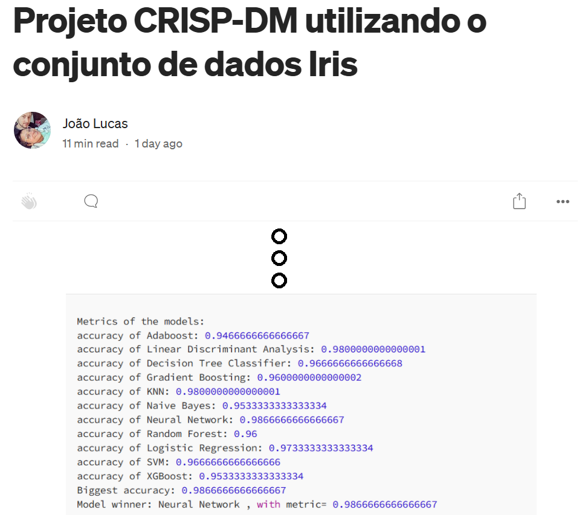

# Welcome to my porfolio for data science!

# About
This repository is reponsible for storing Joao's portfolio. Here, you can see different project examples, with simple explanation, using softwares as R and Python for data science. 
Furthermore, I tell a little about my story and talk about some of my skills developed over time.

# Contact
Please, feel free to contact me via:  
&#8594; <a href="https://www.linkedin.com/in/jo%C3%A3o-lucas-42407b35/">LinkedIn</a>  
&#8594; <a href="https://wa.me/+5551985765763/">WhatsApp</a>  
&#8594; <a href="mailto:joao_perin32@hotmail.com">Email me </a>  

# Articles

# Classification and association
<a href="https://www.mdpi.com/1660-4601/15/6/1149"> Adverse Events Following Immunization in Brazil: Age of Child and Vaccine-Associated Risk Analysis Using Logistic Regression </a>

&#8594; Article published on International Journal of Environmental Research and Public Health;  
&#8594; <a href="https://www.mdpi.com/1660-4601/15/6/1149">You can access the full article here; </a>   
&#8594; In this paper, I talked about vaccination in children. There, you can see some exploratory analysis, associations between vaccines and adverse events using adjusted residuals, odds ratios of hospitalization after each kind of vaccine using logistic regression.   

------------------------------------------------------------------------------------------------------------------------------
# Classification - selecting model winner from 11 model types with k-fold
<a href="https://medium.com/@joaolucasrpt/projeto-crisp-dm-utilizando-o-conjunto-de-dados-iris-0f98de856a56"> Projeto CRISP-DM utilizando o conjunto de dados Iris </a>

&#8594; Article published on Medium;  
&#8594; <a href="https://medium.com/@joaolucasrpt/projeto-crisp-dm-utilizando-o-conjunto-de-dados-iris-0f98de856a56">Documentation; </a>   
&#8594; <a href="https://github.com/JoaoLucasPerin/Iris.git">GitHub; </a>  
&#8594; In this article, I have proposed a project using CRISP-DM methodology to build 11 different statistical models and choose one of them as the winner, using k-fold crossvalidation. Then, you can put new data and predict a categoric class based on them.  
&#8594; Modeling packages used:  
└→<a href="https://scikit-learn.org/"> Scikit-learn </a> (for AdaBoost, Linear Discriminant Analysis, Decision Tree Classifier, Gradient Boosting, KNN, Naive Bayes, Random Forest, Logistic Regression and SVM classifiers + cross-validation model selection),  
└&#8594;<a href="https://pytorch.org/">PyTorch</a> (for neural network classifier),  
└&#8594;<a href="https://xgboost.readthedocs.io/en/stable/python/">XBGoost</a> (for xgboost classifier).  

------------------------------------------------------------------------------------------------------------------------------

